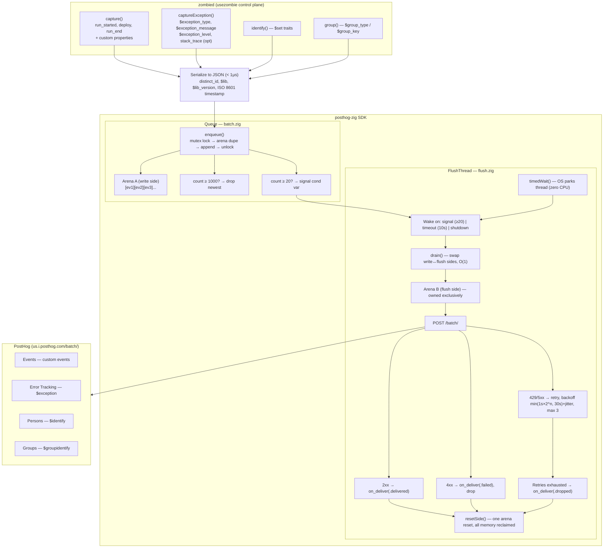

# Architecture

Design decisions, tradeoffs, and the target evolution of posthog-zig.

---

## End-to-end flow: from usezombie to PostHog



### Key timing defaults

| Parameter | Default | Purpose |
|---|---|---|
| `flush_interval_ms` | 10,000 (10s) | Max wait before background flush fires |
| `flush_at` | 20 events | Threshold to wake flush thread early |
| `max_queue_size` | 1,000 events | Per-side capacity; overflow drops newest |
| `max_retries` | 3 | Retry count for 429/5xx responses |
| `shutdown_flush_timeout_ms` | 5,000 (5s) | Reserved for timed join in a future release |
| `feature_flag_ttl_ms` | 60,000 (60s) | Cache TTL for feature flag decisions |

---

## Memory model: double-buffer arena

### The insight

The natural allocation unit is not the event — it is the **flush envelope**. One
flush cycle produces one HTTP POST. Everything in that POST lives and dies together.
That is the definition of an arena.

The obstacle is that events arrive continuously from the calling thread while the
flush thread may be mid-POST. The solution is **ping-pong arenas** (double
buffering).

### Design (implemented in `src/batch.zig`)

```
┌─────────────────────────────────────────────────────────────────┐
│  Arena A  (write side)          │  Arena B  (flush side)        │
│  [ev1_json][ev2_json][ev3_json] │  [being POSTed right now]     │
│  one contiguous backing alloc   │  one contiguous backing alloc │
└─────────────────────────────────────────────────────────────────┘
```

**capture():**
1. Lock
2. Serialize event directly into Arena A (bump pointer, no fragmentation)
3. Append pointer into write-side event index
4. Signal if flush_at reached
5. Unlock — returns immediately

**flush fires:**
1. Lock
2. Swap A ↔ B (one pointer swap, O(1))
3. Unlock
4. Flush thread owns all of B — no contention with producers
5. Build batch payload from B's events (into B itself, or a scratch arena)
6. POST
7. `arena_b.reset()` — O(1), pointer bumped back to zero, backing allocation reused

**New capture() during flush:** writes into A while B is in-flight. No blocking,
no lock contention beyond the initial enqueue.

### Properties

| | Per-event heap (rejected) | Double-buffer arena (current) |
|---|---|---|
| Alloc cost | N mallocs per flush | 1 reset per flush |
| Free cost | N frees | 1 reset (O(1)) |
| Fragmentation | Accumulates over time | None — fixed backing regions |
| Memory bound | Unbounded if flush falls behind | Fixed: 2 × (max_queue_size × avg_event_size) |
| Predictability | Poor under load | Deterministic |
| Crash safety | N orphaned pointers | 2 contiguous regions |

### Sizing

```
backing_size = max_queue_size × avg_event_size
             = 1000 × 2KB = 2MB per arena
total fixed  = 4MB
```

---

## Crash delivery

### Current behavior: best-effort

Current delivery guarantees:

| Shutdown path | Outcome |
|---|---|
| `SIGTERM` → `client.deinit()` | Queue drained, events delivered |
| `SIGKILL` | Queue lost — no delivery |
| Zig panic (unhandled) | Queue lost — no delivery |
| OOM during flush | Retry up to max_retries, then drop |

For handled application errors (`captureException` on a caught error) the queue path
is healthy. For true crashes the queue cannot guarantee delivery.

### Upcoming: crash file (Ghostty pattern)

Ghostty's crash reporter writes a `.ghosttycrash` envelope to disk in the transport
callback — no network call, no allocator, one `write()` syscall on an already-open
file descriptor. The file is uploaded on next startup.

In an upcoming release, `captureException` with `level == .fatal` will:

1. Serialize the event into a stack buffer (no allocator)
2. Write synchronously to `$RUNTIME_DIR/posthog-crash-{uuid}.jsonl`
3. Also enqueue normally (best-effort network delivery if the flush thread lives)

On next startup, `posthog.init()` will check for crash files and deliver them
before the first normal flush. The crash file path is the delivery guarantee;
the queue path is the fast path.

### Why disk-write is safe in a crash handler but network is not

In a panic or signal handler the process is in undefined state. The allocator
may be corrupted. A network call requires:
- Allocating a payload buffer
- TLS state machine (allocates)
- TCP write (may block, may allocate)

A disk write requires:
- A file descriptor (already open, or openable with `O_CREAT | O_APPEND`)
- One `write()` syscall

The double-buffer arena design for the upcoming release makes the disk write trivially cheap:
the write-side arena is one contiguous slice — a single `write()` of
`arena_a.buffer[0..arena_a.end_index]` captures all pending events without
any additional allocation.

### Calling system panic hook

posthog-zig is a library. It cannot install a panic handler. The application
registers one in its root source file:

```zig
// zombied/src/main.zig
const posthog_client = &global_state.posthog;  // app-owned pointer

pub fn panic(msg: []const u8, trace: ?*std.builtin.StackTrace, ret_addr: ?usize) noreturn {
    // Current behavior: best-effort — flush thread may or may not still be alive
    // Call deinit only if you are confident the allocator is healthy.
    // On OOM or UB-triggered panics, skip this.

    // Upcoming: write crash file — safe because it requires no allocator
    // posthog_client.writeCrashFile() catch {};

    std.debug.defaultPanic(msg, trace, ret_addr);
}
```

Keep the panic handler **minimal**. If the panic was caused by allocator corruption,
complex work inside the handler will itself crash. The crash file write in the upcoming release is
designed to require zero allocations for this reason.

---

## Serialization approach

We use a custom `writeJsonStr` helper (in `src/types.zig`) rather than
`std.json.stringify` or `std.json.fmt`. Reasons:

1. `std.json.stringify` was removed in Zig 0.15 — API changed to `std.json.Stringify`.
2. The field values we write are simple (strings, integers, booleans). The overhead
   of the full JSON serializer is not justified.
3. `writeJsonStr` handles the subset we need: proper escaping of `"`, `\`, `\n`,
   `\r`, `\t`, and control characters.

For structured data (feature flag responses), we parse with `std.json.parseFromSlice`
since we need full JSON value traversal. The split is intentional: hand-write
serialization for known shapes, stdlib for unknown shapes.

Comparison to other Zig codebases:

- **nullclaw/audit.zig**: `fixedBufferStream` + stack buffer + `{s}` format. Zero
  allocation, but `{s}` does not escape — safe only for controlled enum/bool values,
  not user-supplied strings.
- **Ghostty/sentry_envelope.zig**: `std.Io.Writer.Allocating` + `std.json.fmt` with
  `.whitespace = .minified`. Cleanest — delegates escaping to stdlib. Requires
  `std.json.Value` as intermediate representation which we avoid for hot-path events.
- **posthog-zig**: `std.io.Writer.Allocating` + `writeJsonStr`. Middle ground —
  heap-dynamic like Ghostty, custom escaping like audit.zig but correct for all
  input.

---

## Observability hooks

### `on_deliver` callback

`Config.on_deliver` is an optional function pointer called by the flush thread after each batch attempt:

```zig
on_deliver: ?*const fn (status: DeliveryStatus, event_count: usize) void = null,
```

`DeliveryStatus` has three variants:

| Status | Meaning |
|---|---|
| `.delivered` | HTTP 2xx received — events accepted by PostHog |
| `.failed` | HTTP 4xx (not 429) — bad data, will not be retried |
| `.dropped` | Max retries exhausted or network error — events lost |

Use this for metrics instrumentation (Prometheus counters, internal dashboards). The callback runs on the flush thread — keep it non-blocking.

### `Queue.droppedCount()`

Returns the cumulative number of events dropped due to queue-full overflow since the client was initialized. Useful for alerting when the write-side arena is consistently saturated.

---

## Testability: injectable function pointers

`FlushConfig` exposes three optional injection points used exclusively for unit testing:

```zig
post_batch_fn: ?PostBatchFn = null,  // replaces transport.postBatch
backoff_fn:    ?BackoffFn   = null,  // replaces retry.backoffNs
sleep_fn:      ?SleepFn     = null,  // replaces std.Thread.sleep
```

When `null` (production), the real implementations are used. In tests, `FlushMock` in `src/flush.zig` injects deterministic status sequences, zero-delay backoff, and a no-op sleep — making retry/drop/callback scenarios testable without network or real time.

This pattern keeps the flush loop free of test-only branches while remaining fully exercisable.

---

## Manual flush and its tradeoffs

`client.flush()` is a synchronous, one-shot drain:

```zig
pub fn flush(self: *PostHogClient) !void {
    const result = self.queue.drain();
    defer self.queue.resetSide(result.side_idx);
    if (result.events.len == 0) return;
    _ = try transport.postBatch(self.allocator, self.config.host, self.config.api_key, result.events);
}
```

**No retry.** Unlike the background flush thread which retries up to `max_retries` times with exponential backoff, `flush()` makes one attempt. If PostHog returns 5xx or the network fails, the error is returned to the caller and the events are dropped (the arena side is reset by `defer`).

This is intentional: `flush()` is designed for use in shutdown sequences where the process is about to exit. A retry loop inside `flush()` would block `deinit()` beyond the caller's expectation. If retry-on-manual-flush is needed, call `flush()` in a loop with your own backoff logic, or rely on the background thread.

**`shutdown_flush_timeout_ms` is not yet enforced.** `FlushThread.stop()` calls `thread.join()` which is currently unbounded. The timeout parameter is accepted for API stability and will enforce a timed join in an upcoming release.

---
